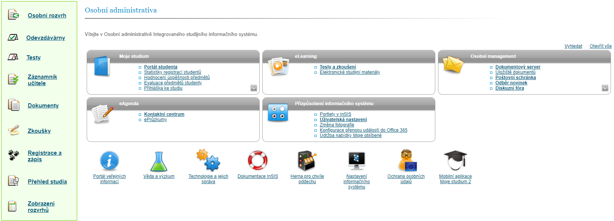
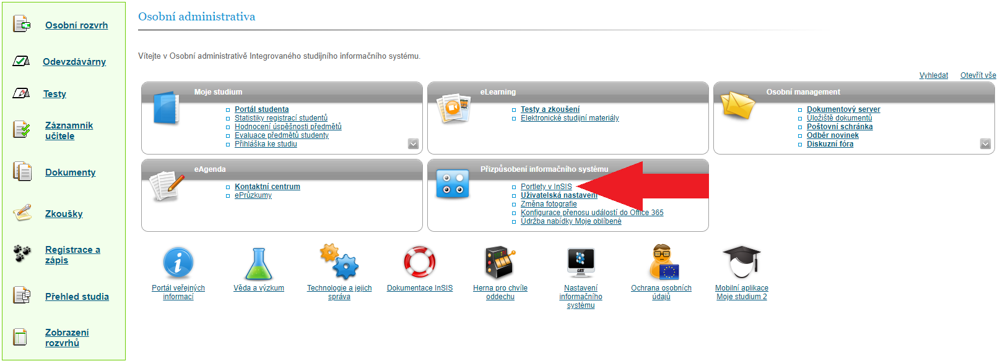
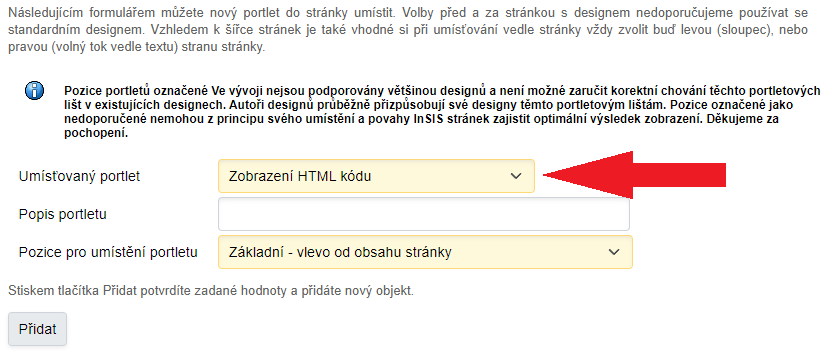
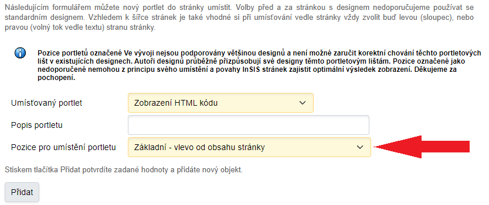
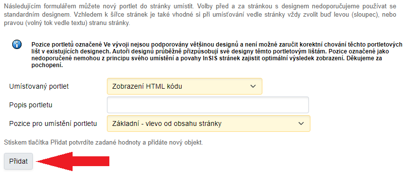
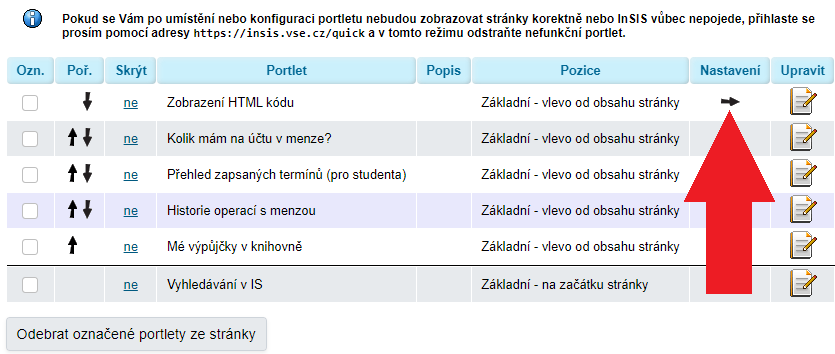
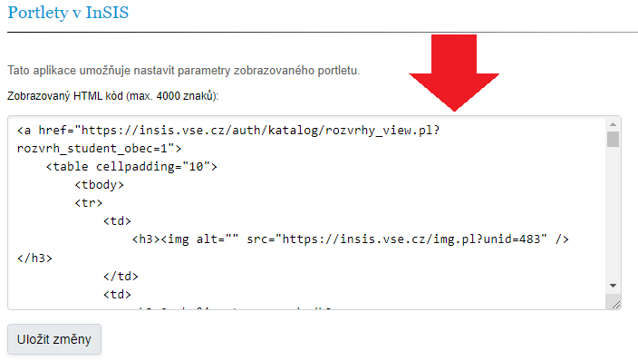
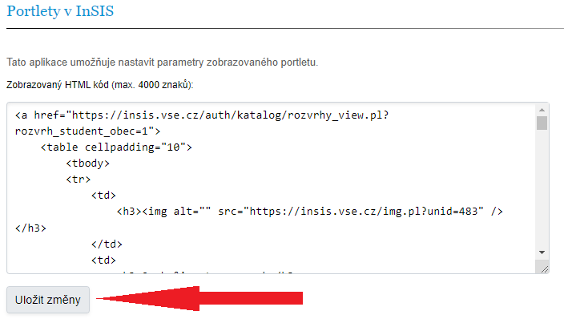

# InSIS-VSE-portlet

Sibebar pro studenty jako portlet v InSISu

## Pokyny pro implementaci

1.  v menu *Přizpůsobení informačního systému* zvol *Portlety v InSIS*\
    

2.  v *Umísťovaný portlet* zvol *Zobrazení HTML kódu*\
    

3.  v *Pozice pro umístění portletu* nech na *Základní - vlevo od obsahu stránky*\
    

4.  klikni na tlačítko *Přidat*\
    

5.  klikni na šipku ve sloupci *Nastavení* u daného portletu\
    

6.  do textového pole vlož html kód z *portlet.html*\
    

7.  klikni na *Uložit změny*\
    

8.  hotovo
